# 会议记录与摘要生成软件介绍

## 软件信息

软件名称：会议记录与摘要生成软件

版本：5.0.1

软件著作权登记号：2023SR1804554 (v4.2)

## 软件介绍

会议记录与摘要生成软件主要包含了会议记录和摘要生成的功能，用户连接好麦克风、运行好软件之后，即可开始实时记录会议内容到指定文件，会议记录完成后点击摘要生成，可以本地生成会议记录文本的摘要

本会议记录软件除语音识别功能需在内网服务器上运行以外，其余都为本地运行（包括摘要生成）

## 软件使用说明

**版本：5.0.1**

##### 1. 下载软件，并解压至指定目录

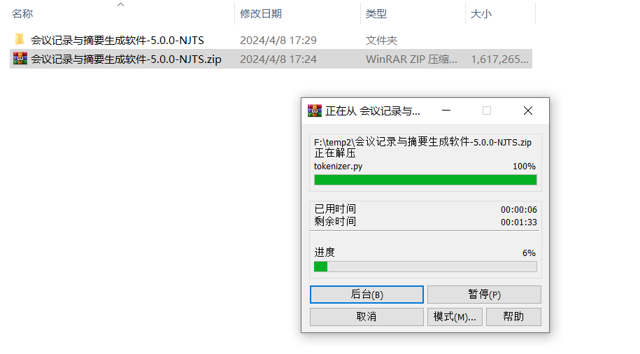

##### 2. 双击"meeting_record_assistant.exe"即可运行软件，首次启动可能较慢

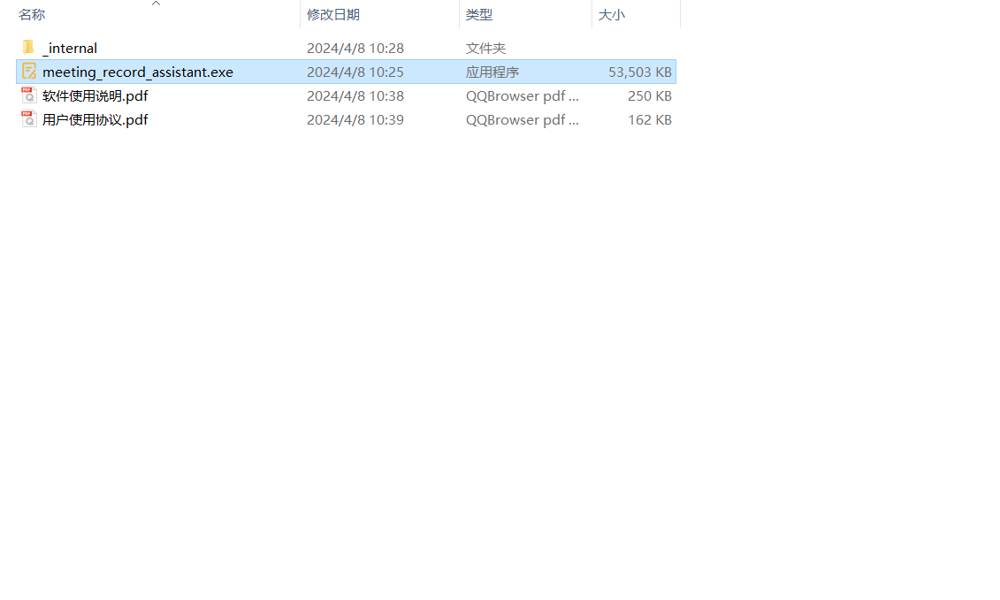

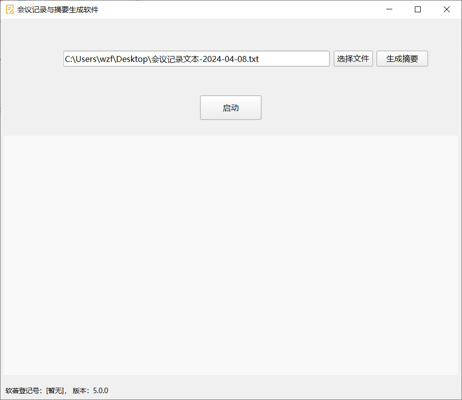

##### 3. 点击“选择文件”，选择会议记录文本要存放的文件（摘要也会生成在该文件的最后）

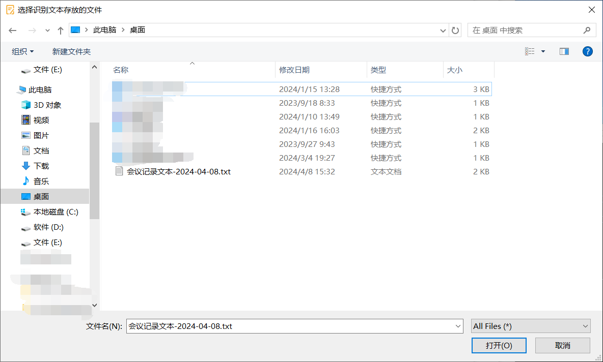

##### 4. 点击“启动”，开始语音识别（语音转文字）

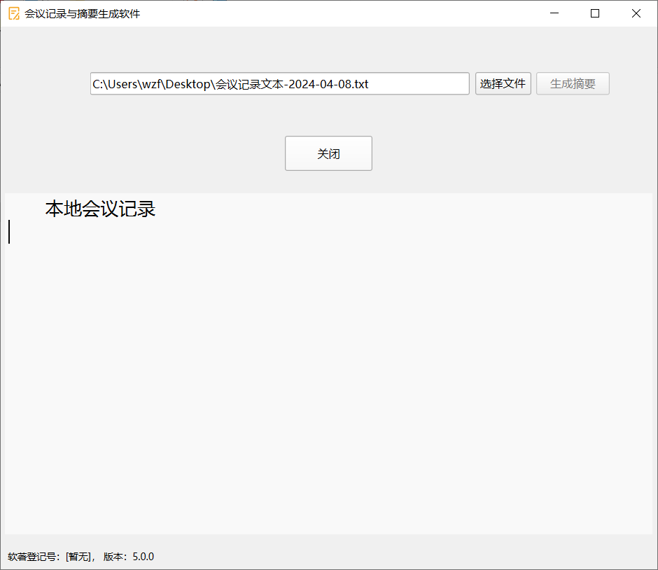

##### 5. 点击“关闭”，停止语音识别，然后点击生成摘要，开始摘要生成，生成的摘要在语音识别记录文件的最后

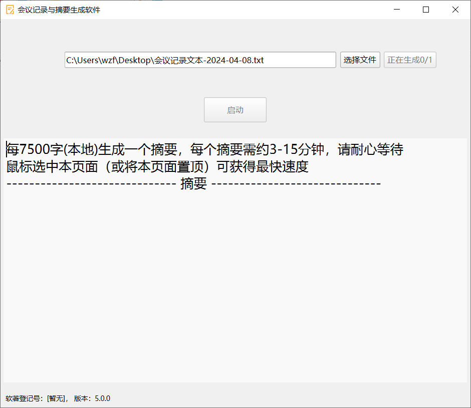

## 注意事项

1. 打开本软件之前，请确认您的麦克风或输入设备是否正常，具体步骤如下：

   - 打开windows系统设置

     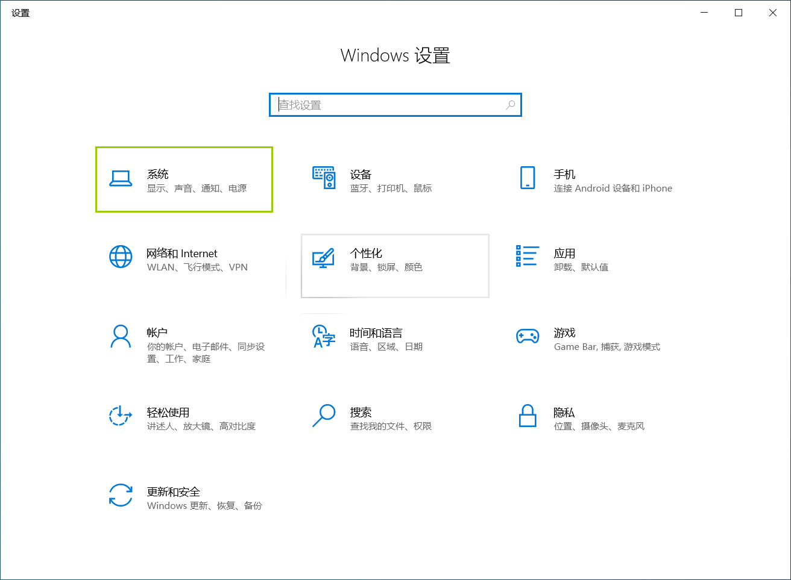

   - 点击系统 -> 声音，选择声音输入设备

     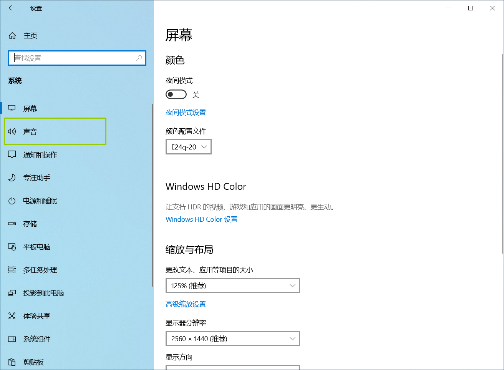

     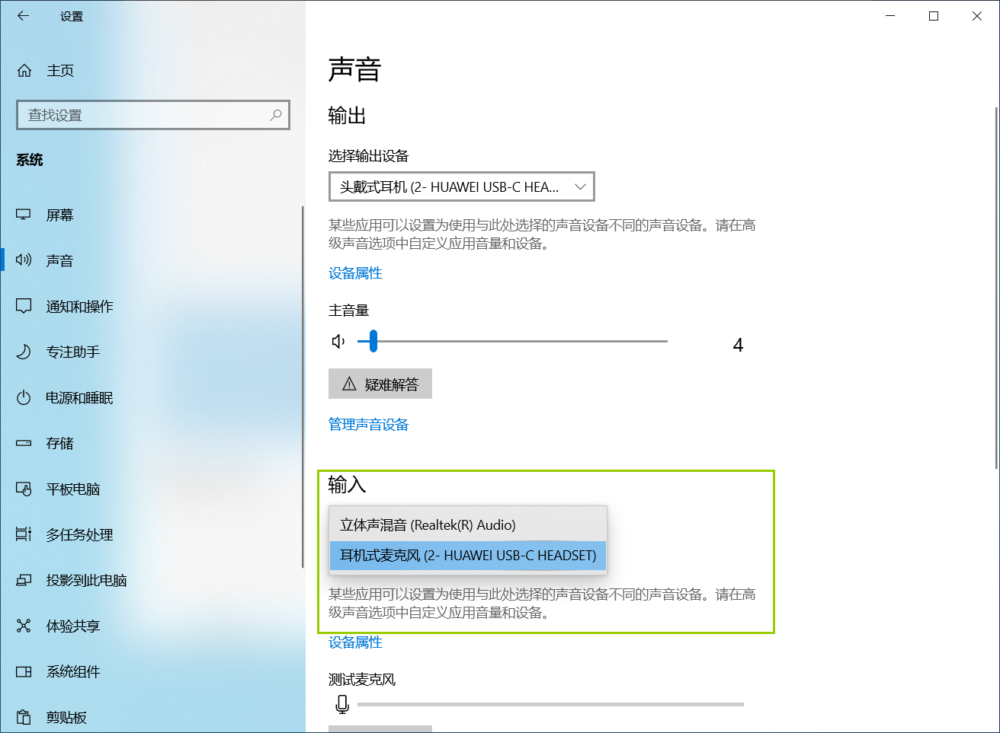

   - 点击设备属性 -> 开始测试，测试麦克风是否正常，软件会自动使用默认的麦克风

     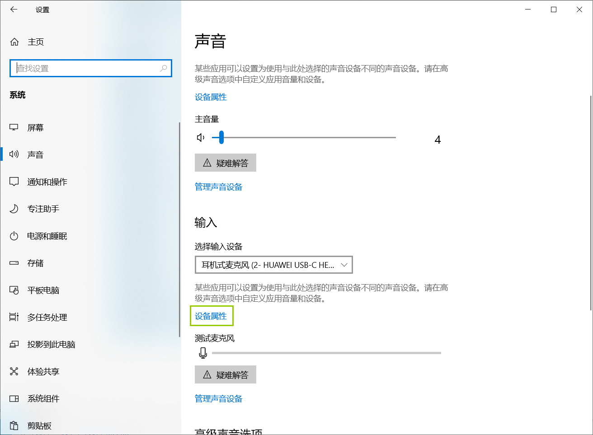

     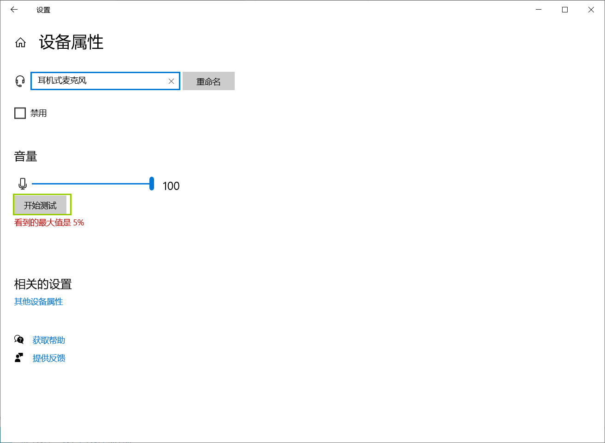

2. 请在使用本软件之前打开内网所在的互联网（如校园网）