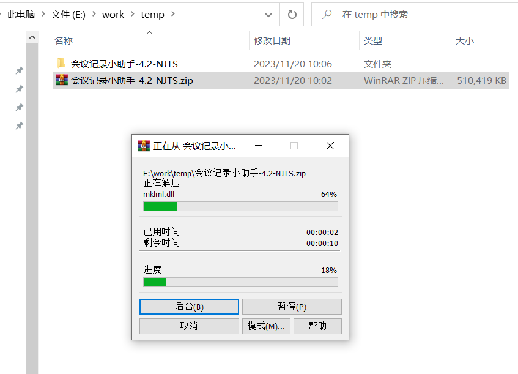
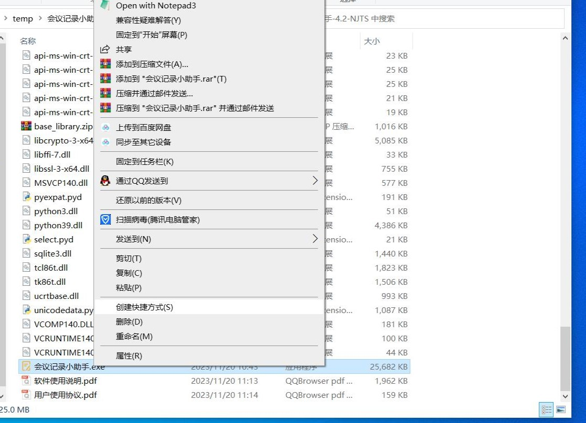
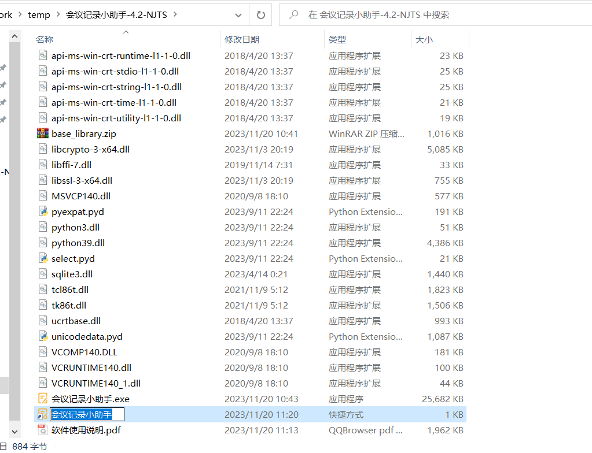
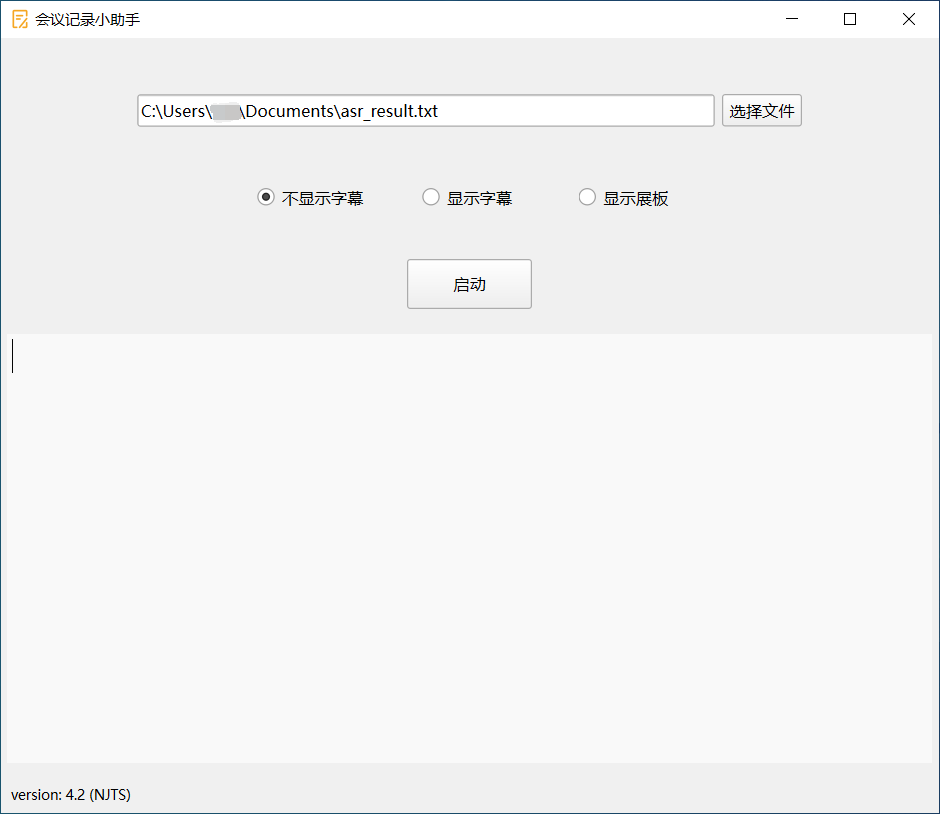
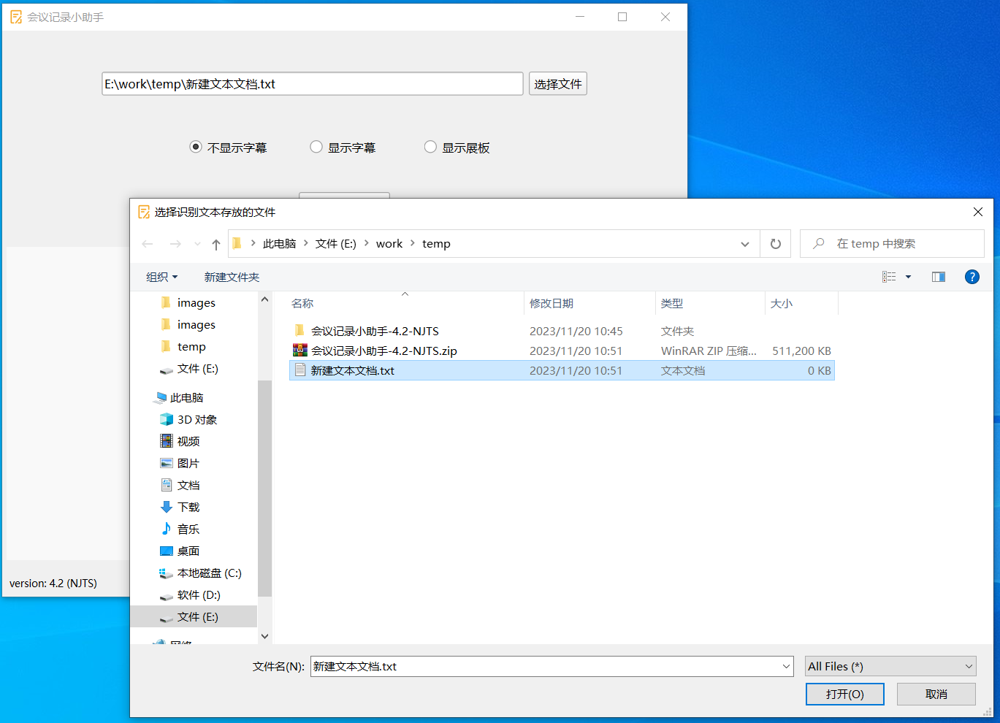
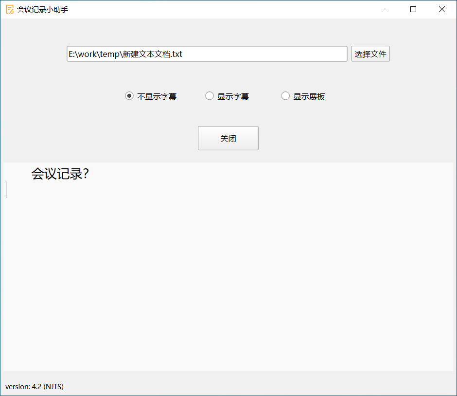
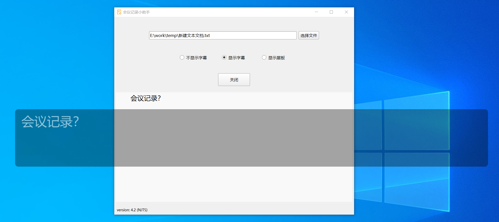
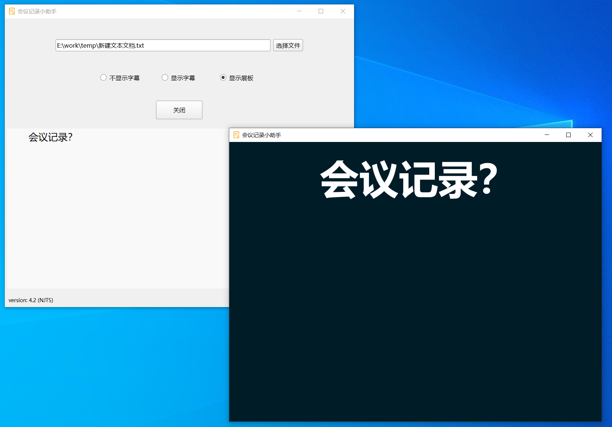

# 软件信息

软件名称：会议记录小助手

版本：4.2.1

软件著作权登记号：2023SR1804554

# 软件使用说明

**版本：4.2.1**

##### 1. 下载软件，并解压至指定目录

##### 2. 找到"会议记录小助手.exe"，右击创建它的快捷方式

##### 3. 将快捷方式重命名并移直桌面

##### 4. 双击快捷方式即可运行软件，首次启动可能较慢

##### 5. 用户首先可以选择会议记录文本要存放的文件

##### 6. 然后选择不显示字幕、显示字幕和显示展板三种字幕显示方式之一（点击单选框），点击启动按钮即可开始进行会议记录与文字展示，启动后点击关闭按钮或关闭窗口即可停止录音、识别与记录。

##### 7. 软件启动前请确保您的设备已经接入麦克风设备且网络畅通，本软件使用系统默认的音频输入设备进行录音